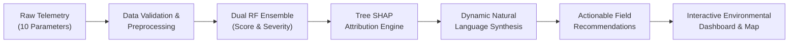

# HydroGuard-XAI: Explainable AI-Based River Pollution Risk Prediction System

[](https://www.python.org/)
[](https://fastapi.tiangolo.com/)
[](https://reactjs.org/)
[](https://www.typescriptlang.org/)
[](https://tailwindcss.com/)
[](LICENSE)

> **"Explainable AI for Early River Pollution Risk Prediction & Actionable Environmental Intelligence"**

---

## 1. Executive Summary & Problem Statement

River pollution detection is often delayed because conventional environmental monitoring relies on periodic grab sampling and laboratory turnaround times ranging from days to weeks. By the time contamination is confirmed, toxic effluent and hypoxic water have dispersed downstream—compromising municipal drinking water intakes, degrading biodiversity, and causing severe fish mortality.

**HydroGuard-XAI** bridges this gap by combining continuous water-quality telemetry, machine-learning ensembles, **tree-based Explainable AI (Tree SHAP)**, and proactive early-warning analytics. Instead of delivering a black-box risk score, HydroGuard-XAI explains **WHY** the river is at risk and provides prioritized, context-aware **action recommendations** for rapid field verification and pollution mitigation.

---

## 2. Core Paradigm: PREDICT → EXPLAIN → ACT



1. **PREDICT**: Quantifies continuous pollution risk ($0 - 100$) and classifies severity into **LOW**, **MODERATE**, **HIGH**, or **CRITICAL**.
2. **EXPLAIN**: Quantifies exact positive and negative feature contributions (SHAP values) and dynamically synthesizes plain-language ecological explanations.
3. **ACT**: Maps the primary pollution drivers to concrete, prioritized interventions (e.g., municipal intake buffering, rapid field sampling, STP outfall audits, mobile surface aeration).

---

## 3. Technology Stack

* **Machine Learning & Data Science**:
  * Python, NumPy, Pandas, Scikit-Learn (`RandomForestClassifier`, `RandomForestRegressor`)
  * Custom pure-Python Exact Tree SHAP feature attribution engine (exact path-level marginal contributions)
  * Standard Water Quality Index (WQI) computation (CPCB & Canadian WQI standards)
* **Backend API**:
  * FastAPI (Python) with Pydantic request/response validation
  * Uvicorn ASGI server with full CORS support
* **Frontend Web Application**:
  * React 18 with TypeScript & Vite
  * Tailwind CSS with customized cyber/scientific dark telemetry theme
  * Recharts (Dynamic horizontal feature attribution bars, multi-metric time-series curves)
  * Lucide React icons

---

## 4. Input Parameters & Scientific Standard Ranges

| Parameter | Unit | Standard Safe Baseline | Environmental Significance |
| :--- | :--- | :--- | :--- |
| **pH Level** | — | `6.5 - 8.5` | Chemical balance; values $<6.0$ or $>8.5$ indicate industrial effluent or acid shock. |
| **Turbidity** | `NTU` | `0.0 - 10.0` | Particulate suspension; elevated values block sunlight photosynthesis and carry adsorbed toxins. |
| **Dissolved Oxygen (DO)** | `mg/L` | `> 6.0` | Aquatic respiration; critical levels ($<3.5$ mg/L) indicate acute hypoxia from organic decay. |
| **Water Temperature** | `°C` | `18.0 - 28.0` | Thermal pollution; higher temperatures decrease gas solubility and accelerate microbial decay. |
| **Electrical Conductivity** | `µS/cm` | `100 - 500` | Dissolved ionic minerals; surges indicate agricultural fertilizer wash or chemical ingress. |
| **Total Dissolved Solids (TDS)** | `mg/L` | `50 - 300` | Salinity and dissolved mineral burden. |
| **BOD (Biochemical Oxygen Demand)**| `mg/L` | `< 3.0` | Organic loading; high values signal untreated domestic sewage or food-processing wastewater. |
| **COD (Chemical Oxygen Demand)** | `mg/L` | `< 15.0` | Refractory industrial chemical contamination. |
| **Rainfall Intensity** | `mm` | `0.0 - 50.0` | Non-point source overland surface runoff and silt flush. |
| **Water Flow Rate** | `m³/s` | `50 - 400` | Natural dilution capacity; stagnant low flow concentrates localized contaminants. |

---

## 5. Machine Learning & XAI Architecture

### Model Training Pipeline
The ML pipeline trains dual Random Forest models on 2,400 balanced, physically consistent river observations covering four operational regimes:
* Baseline Clean Freshwater
* Agricultural Non-Point Runoff
* Urban Low-Flow Sewage & Hypoxia
* Industrial Chemical & Acid Inflow

### Prototype Evaluation Metrics
* **Classification Accuracy**: **94.58%**
* **Precision (Weighted)**: **94.59%**
* **Recall (Weighted)**: **94.58%**
* **F1-Score (Weighted)**: **94.28%**
* **Regression MAE**: **1.00 points**
* **Regression RMSE**: **1.68 points**
* **$R^2$ Score**: **0.9967**

### Exact Tree Feature Attribution (SHAP Methodology)
For any input vector $x$, the local feature attribution $\Delta_j$ for each tree node split is calculated across all $T$ decision trees:
$$\hat{y}(x) = \text{base\_value} + \sum_{j=1}^{M} \Delta_j$$
* $\Delta_j > 0$: Feature $j$ **increased** the predicted pollution risk.
* $\Delta_j \le 0$: Feature $j$ **mitigated** or buffered the predicted risk.

---

## 6. Key Features & Dashboard Walkthrough

1. **Executive Overview Cards**:
   * Current Risk Classification Badge (LOW / MODERATE / HIGH / CRITICAL)
   * Pollution Risk Score Gauge ($0 - 100\%$)
   * Canadian Water Quality Index (WQI) Score
   * Telemetry Timestamp & ML Model Confidence %
2. **Early Pollution Warning Surge Banner**:
   * Automatically calculates delta between sequential observations.
   * Raises high-priority banner when risk increases by $\ge 15$ percentage points (e.g., $42\% \to 78\%$, $+36\%$).
3. **Interactive Analysis Laboratory**:
   * 1-Click Demo Scenarios (Pristine, Agricultural Runoff, Urban Sewage, Industrial Effluent)
   * Two-column interactive sliders and numeric inputs with unit tags and safe range cues.
   * Real-time prediction preview card and parameter status matrix.
4. **Explainable AI (XAI) Deep Dive**:
   * *"Why is this river at risk?"* prominent card.
   * Horizontal bar chart displaying positive (red/orange) and negative (emerald) feature attributions.
   * Ranked Top Pollution Drivers breakdown.
   * Dynamic natural-language environmental narrative synthesis (no hardcoded fixed sentences).
   * Prioritized Action Plan (Field verification, utility intake alerts, STP audits, mobile aerators).
5. **Historical Trends & Timeline**:
   * 7-day, 30-day, and 90-day time-series graphs for Risk Score, DO vs. BOD inverse curves, and Turbidity vs. Rainfall.
   * Chronological tabular timeline with highlighted early-warning surge events.
6. **Regional River Basin Monitoring Map**:
   * Geospatial visual map of Southern Peninsular river stations (Cauvery, Bhavani, Noyyal, Vaigai, Tamaraibarani, Sample River).
   * Color-coded risk markers with interactive telemetry inspector cards.
7. **Live Simulated IoT Stream Mode**:
   * Real-time telemetry tick mode demonstrating continuous edge sensor ingest, anomaly tracking, and automated XAI triggering.

---

## 7. Installation & Quick Start

### Prerequisites
* Python 3.10+ (Anaconda or Standard Python)
* Node.js v18+ and npm

### 1. Clone & Setup Backend
```bash
cd hydroguard

# Install Python dependencies
pip install -r requirements.txt

# (Optional) Retrain ML Model & Regenerate Dataset
python ml/train_model.py
```

### 2. Setup Frontend
```bash
cd frontend
npm install
cd ..
```

### 3. Launch Both Servers Simultaneously
```bash
python run_servers.py
```

Or run them in separate terminals:
* **Backend**: `cd backend && python -m uvicorn main:app --reload --port 8000`
* **Frontend**: `cd frontend && npm run dev`

Open your browser at: **`http://localhost:5173`**
Backend Swagger API Documentation: **`http://127.0.0.1:8000/docs`**

---

## 8. API Endpoint Documentation

| Method | Endpoint | Description |
| :--- | :--- | :--- |
| `POST` | `/api/predict` | Runs ML inference, exact Tree SHAP attributions, dynamic explanation, and action recommendations. |
| `GET` | `/api/stations` | Returns active river monitoring stations with current risk scores and coordinates. |
| `GET` | `/api/trends/{location}?range=30d` | Returns time-series observations (7d, 30d, 90d) and surge anomaly timeline. |
| `GET` | `/api/alerts` | Returns active real-time pollution incident alerts. |
| `GET` | `/api/scenarios` | Returns 4 preset demo scenarios for instant evaluation. |
| `POST` | `/api/simulate-stream` | Simulates an incoming IoT sensor packet with micro-fluctuations. |
| `GET` | `/api/health` | Health status and model evaluation metadata. |

---

## 9. 10-Second Judge Evaluation Demonstration Guide

When presenting to judges or reviewers:
1. **Open Dashboard (`http://localhost:5173`)**:
   * Point to **Cauvery River** showing **HIGH RISK (78%)** and the **Early Warning Banner** ($+36\%$ surge).
2. **Switch to "Analyze River"**:
   * Click **"Pristine / Safe Baseline"** demo button $\to$ Click **"ANALYZE POLLUTION RISK"** $\to$ Instantly shows **LOW RISK (14%)** with all green normal parameters.
   * Click **"Industrial Acid / Effluent Discharge"** $\to$ Click **"ANALYZE POLLUTION RISK"** $\to$ Instantly shows **CRITICAL RISK (86%)** with critically low pH and high COD.
3. **Switch to "XAI Explanation"**:
   * Highlight the **Horizontal Feature Importance Chart** showing exact positive contribution bars.
   * Read the dynamic **synthesized ecological explanation** (e.g. acidic shock and low DO).
   * Show the **Actionable Recommendations** (Industrial cluster audit, emergency intake alert).
4. **Switch to "Trends & Timeline" & "River Map"**:
   * Show 30-day DO vs BOD inverse curve and regional station markers on the map.

---

## 10. Prototype Disclaimers & Future Scope

> **Notice**: This prototype is developed for student innovation competitions, hackathons, and decision-support demonstration. The models and data are simulated based on standard environmental literature (CPCB, EPA, WHO). Predictions are intended to assist field officers and should not replace certified laboratory chemical assays or statutory regulatory rulings.

### Future Roadmap
* Direct MQTT/LoRaWAN sensor hardware integration (ESP32 / Raspberry Pi optical probes).
* Multi-basin spatial hydro-dynamic dispersion modeling.
* Satellite remote sensing integration (Sentinel-2 multispectral chlorophyll-a and turbidity indices).
